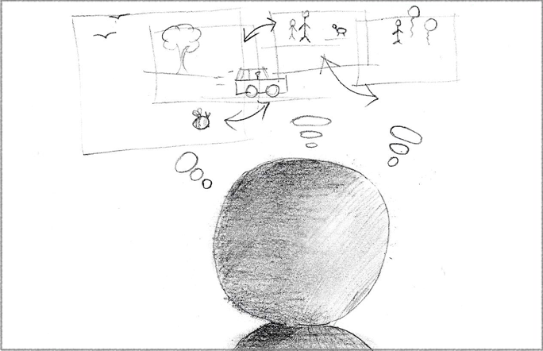
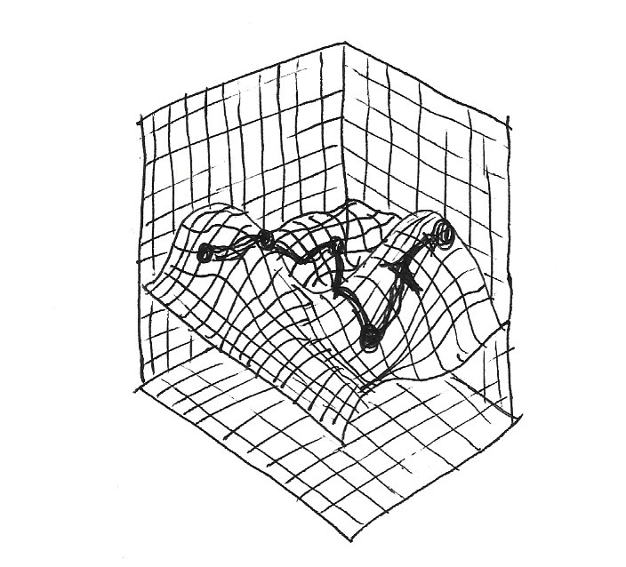
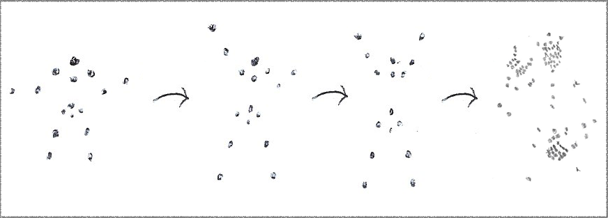
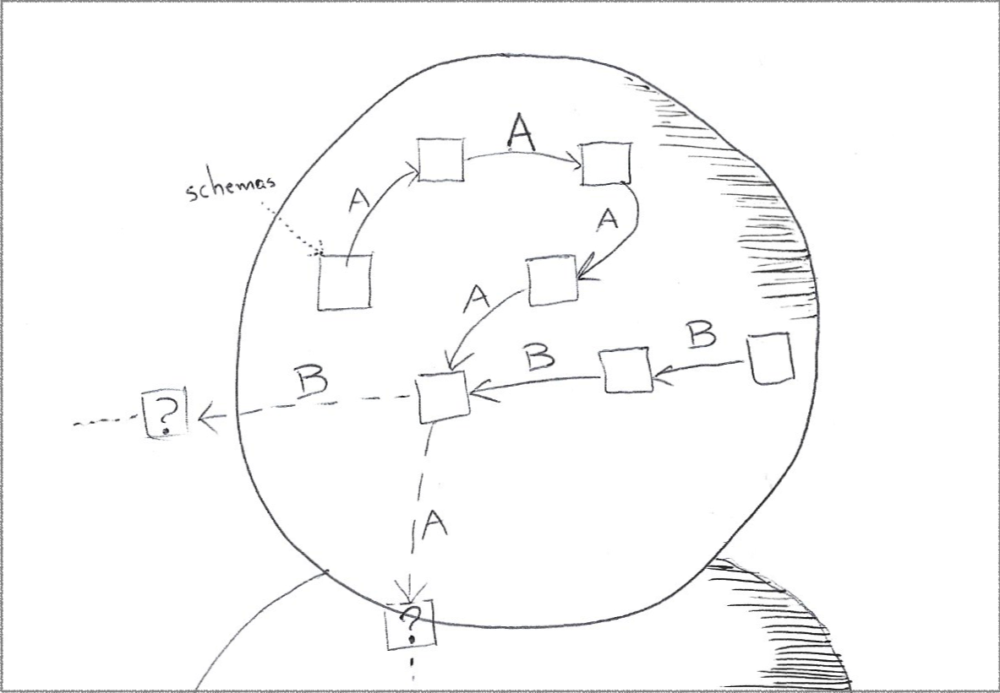

# The Artificial Empathy of Generative AI

_When Imitation Is the Sincerest Form Of Failure_

_“We’re done. We are flipping it.”_

After training an AI for six days, a group of Marines was told to defeat its advanced detection capabilities. A robot running the system was placed in a traffic circle. The task was to approach the sentry, undetected, from a long distance, then touch it.

This DARPA ([Defense Advanced Research Projects Agency](https://www.darpa.mil/)) experiment is described in the book “Four Battlegrounds: Power in The Age of Artificial Intelligence” by Paul Scharre. It illustrates the difference between narrow AI and human intelligence:

> “Eight Marines-not a single one got detected,” Phil said. They defeated the AI system not with traditional camouflage, but with clever tricks that were outside of the AI system’s testing regime. “Two somersaulted for 300 meters; never got detected. Two hid under a cardboard box.

Leaving the realm of warfare on the sidelines for a moment, society finds itself running a similar experiment, training something artificial to mimic our abilities.

At the end of that experiment, humanity anticipates outcomes split into two separate tracks:

1. **Partnership**. “Narrow” AIs have proven their place in society by focusing on activities such as transcribing voice sounds, offering better traffic routes, and detecting manufacturing defects.
2. **Conflict**. Now and then, we catch disturbing glimpses of a near future where AIs can beat us with overwhelming numbers, processing speed, and efficiency — In another passage of that book, an expert human pilot is bested multiple times in a simulated dogfight against an AI.

Door number 1 is utopia. Door number 2 is judgment day, but with a twist: _AIs will take our jobs first._

While the doomsday of door number 2 is solidly in the realm of fiction — at least for now — the “displacement” twist dominates the near term. But how do the near-term, or even long-term, AIs stack up against human beings?

Not very well.

---

## The Business Model of “Fast-empathy”

The cynics will point out that the _AI doesn’t have to feel real._ It only has to feel close enough to deliver a passable impression for a slightly lower price. That would be somewhat similar to the fast-food business model, but producing “humans” that don’t require food.

That is at least an honest argument. And that fast-food analogy tastes, oh, so delicious here. I can’t avoid extending it with a nod to the landmark documentary [“Super Size Me,”](https://en.wikipedia.org/wiki/Super_Size_Me) where filmmaker Morgan Spurlock nearly dies while attempting a 30-day diet of nothing but fast food.

But is “fast-empathy” that bad? Once AI bots get past their [growing pains](https://medium.com/geekculture/microsofts-new-chatbot-turns-evil-e6272aa74023), could they be wrapped as “Sidney Number 1” or “Tay Wrap Number 5” and taste, nay, produce “close enough” interactions that feel human?

And “close enough” has to be the core strategy for mass adoption because attempting to understand how humans function is really hard. The AI industry knows that, so it is going all-in on machine learning approaches like the ones exemplified in this story’s opening: look at many examples until a pattern emerges.

In that sense, a tool like ChatGPT does not attempt to emulate humans. Instead, it tries to predict what humans would say in response to a prompt.

The recipe is effective: Add a bit of hedging across sentences, pack knowledge tight into paragraphs, apply filler words to taste, let humans [anthropomorphize](https://www.wired.com/story/artificial-intelligence-animals-anthropomorphism/) what they see, and another interaction is served with a warning: Contents are hot and may contain [hallucinations](https://en.wikipedia.org/wiki/Hallucination_%28artificial_intelligence%29).

When you are starving for answers, it will do the job.

So what separates that packaged experience from the genuine article? And how many people can actually tell the difference?

In short: “A lot” and “All of us.”

For a longer answer, read on.

---

## A World of Schemas for the World

The functioning of the human brain remains a mystery in progress. Still, where neuroscience fails us, psychology leads the way by observing and cataloging mental processes.

One concept, in particular, explains the mental process of accumulating knowledge: “[**schemas**](https://en.wikipedia.org/wiki/Schema_(psychology)).” From Wikipedia:

> In psychology and [cognitive science](https://en.wikipedia.org/wiki/Cognitive_science), a schema (plural schemata or schemas) describes a pattern of thought or behavior that organizes categories of information and the relationships among them.

We have schemas for everything. Bees, driving, family relations, dogs, cooking, you name it — I wrote about their technological cousins, semantic networks, in [“What Is the Hardest Thing in Software Development?”](https://dnastacio.medium.com/real-to-virtual-b2bacd2423c9)

Whenever we approach a situation, we bring relevant schemas into the brain’s working memory and use them to help us process the information and formulate our actions.

The closest concept to schemas in Artificial Intelligence is probably “f[rames](https://en.wikipedia.org/wiki/Frame_(artificial_intelligence)),” supported by related concepts such as ontology languages and semantic networks:

> **Frames** are an artificial intelligence data structure that divides knowledge into substructures by representing “stereotyped situations.”

Like us, machines are pretty good at matching frames based on their attributes, using the sheer power of statistics.

The differences start from here.

---

## The Ultimate Learning Machine

We know the brain is adaptable, but how adaptable?

Every time it processes information that does not quite fit its various schemas, it leaves its state of equilibrium between what it “sees” and what it “knows.” That is the process of **assimilation**.

That creates tension, a state of imbalance that needs to be addressed. The brain eliminates that tension using a process known as **equilibration**.

That is right; not recognizing something around us, real or abstract, physically bothers us. It triggers a psychological reaction. Curiosity.

Knowing things is not an option; to be at ease with our surroundings, we _must_ understand.

And while an AI can be instructed to emulate that behavior to create arrows of intent, it lacks that third pillar of constructivist ability: **accommodation**.

The brain _rewrites its schemas_ to accommodate new information. That is an intricate process that AI covers under the banner of [Zero-Shot Learning](https://en.wikipedia.org/wiki/Zero-shot_learning) (ZSL.)

Back to this story’s opening scene, where Marines deceived an AI detection system trained on their movements, two of them successfully used cardboard boxes as cover to throw off the algorithm.

In the unlikely event of a human brain being fooled by the first camouflaged attempt, it is virtually impossible that the same person would be fooled a second time.

Forget about succeeding at ZSL by telling an AI trained on horse images about zebras being like horses with stripes. The human brain plays on a rarefied plane much higher than an AI can achieve in the foreseeable future.

Our brains engage many different schemas when facing the cognitive dissonance of that moving box. To mention only a few:

* A **schema of a cardboard box**, from appearance to behavior, such as boxes only moving under specific conditions and following certain patterns, such as tumbling down a road under heavy wind.
* The **contextual schema of survival** associated with being in a (simulated) war zone, where unidentified things that move toward you are potentially things that can kill you.
* The **composite schema** of a cardboard box and wind. The brain can detect whether the tumbling is mismatched with the motion of surrounding objects, like tree branches standing still.

The brain may not even realize what it is doing. It just does it.

The level of semantic redundancy in human thought is in the realm of science fiction for those working in AI. The challenge is not Artificial General Intelligence (AGI) displacing knowledge workers; it is picking up on clues like a 4-year-old.

Now things start to get really interesting.

---

## Thoughts Have a Rhythm

Earlier, I mentioned the mechanism of “[spreading activation](https://www.sciencedirect.com/topics/computer-science/spreading-activation).”

For example, someone may be talking about going to the grocery store. Your brain starts looking for related schemas, such as _“Things we typically buy at the supermarket”_ and _“How to take inventory of what we need?”._

Depending on the context, other less apparent schemas may be activated, such as _“When should we make the trip?”_ and _“It is dark and raining; can it wait until tomorrow?”_

If we could represent our knowledge as a map and each schema represented a location on that map, the sequence of schemas would form an itinerary with stops.

Our schema activation follows the surface of our knowledge. Different people may arrive at the same conclusions, but may follow very different paths in getting there

Start and destination. The mind somehow charts a path or makes one up along the way, and the brain executes the connections.

Given the same inputs, our thought process may share the destination and some stops. But journeys are dynamic, uneven, bumpy things. They have different sequences of events, detours, and paces between visits.

The journey of thoughts has motion and gait.

---

## Embodied Cognition: When Life Recognizes Life

As our thought process moves along the surface of our knowledge, it follows a pattern. Our brain also decides which portions of that trajectory should leave a trail in the physical world, such as a movement, a sound, or written words.

And what has evolved through millions of years and is equipped to recognize that trail at a cellular level using a process called [Biological Motion Perception](https://en.wikipedia.org/wiki/Biological_motion_perception)? You know it.

From Wikipedia:

> Biological motion perception is the act of perceiving the \[unique fluid\] motion of a biological agent. … Humans and animals can understand those actions through experience, identification, and higher-level neural processing.

In other words, life forms are born experts in recognizing movement from other animals.

It gets better when you look through the scientific lenses of [embodied cognition](https://en.wikipedia.org/wiki/Embodied_cognition). We don’t just recognize biological motion; _we experience it using the same neural mechanisms engaged in performing the movement._

Can you tell these dots resemble human postures?

Now think about what embodied cognition means for the act of reading when you consider this passage from that same Wikipedia page:

> An fMRI study examining the relationship of mirror neurons in humans with linguistic materials has shown that there are activations in the premotor cortex and Broca’s area — a key component of a complex speech network — when reading or listening to sentences associated with actions.

While we do not observe natural motions as we read the words, we imagine those motions. And because we imagine them, _we also experience them_.

On the flip side, don’t you ever read two paragraphs of AI-generated text and quickly recognize it was not written by a human? I do, and so do [professional magazine editors](https://www.theverge.com/2023/2/25/23613752/ai-generated-short-stories-literary-magazines-clarkesworld-science-fiction). As the brain shuffles the mental schemas required to process the text, it is conceivable that it also tries to experience the “biological motion” of the progression.

As I read an AI-generated article, I can feel the mismatches in my mental schema for human writing: There is no trajectory. There is no missing stop, choice, absence, or emphasis. It activates schemas in my brain in ways that human prose does not.

---

## The Gold Standard for Empathy: Backed by Humans

As a thought experiment, let’s wave off everything so far.

Let’s assume our existence is down to mostly repeatable patterns, and a machine can eventually replicate it and respond to humans just like another human.

Assume it emulates the tension of not knowing what others are thinking and simulates the continuous curiosity in trying to fill that gap. Let’s pretend the machine starts by learning about someone from whatever online footprint it can access and continues by asking questions to the person it is talking to.

In short, pretend we achieve human-like levels of Artificial General Intelligence, or AGI, one of the holy grails of AI.

Even if a computer eventually mimics the “shape” of the human language, down to its trajectory, should it matter that a great interaction with something that sounds human did not come from a human?

Maybe we moved too fast toward debating whether AIs can take our jobs and subconsciously avoided talking about what stops machines from replacing us outside work.

Imagine the ads: _“Problems at school? Parents busy? Download the iHearYou app for $2.99 today!”_

However, I don’t think it will happen.

That is partly because I think the technology to imitate human thought at that level requires a model of human life itself. For that, we need to know how to _create_ life in the first place. For reference, we finished mapping the [human genome](https://www.genome.gov/human-genome-project) two decades ago. Even as our knowledge about DNA improved considerably, we barely scratched the surface of how genes affect our bodies.

At a more pragmatic level, the other reason is that people who understand AI — much better than I do — think deep learning [will not give us AGI](https://medium.com/@RebelScience/deep-learning-is-not-just-inadequate-for-solving-agi-it-is-useless-2da6523ab107), and there are no signs of alternatives. Not at the levels of ChatGPT success and popularity, at least.

---

## Human Narratives: The Power of Reasoning

The current public discourse about AIs like ChatGPT creates a narrative of a rare and sweeping humanity-changing event.

_“ChatGPT crossed one million users within a week of its launch.”_

First adopters declared ChatGPT responses akin to interacting with another human, better than web searches, and an extraordinary productivity booster. Some went as far as comparing ChatGPT to the discovery of the atom, a pivotal moment in the history of humanity — I am not exaggerating the reactions.

_“It can pass medical exams.”_

_“It can replace … you.”_

_“ChatGPT will NOT replace you, but someone using ChatGPT will.”_

_“Change happened, and humanity is divided along the line of those who embrace it.”_

Do you recognize the trajectory and shape of that chatter? Does it invite you for the ride, or does it make you feel like your future is bleak if you don’t come aboard?

There are useful stops in that journey and valid points in the narrative, but the whole ride does not feel that great. Your brain is telling you something is…off. When was the last time we heard something like this?

_“It is new. It is great. It is selling fast. Don’t be left behind. Get yours now!”_

That is not to downplay the achievement of an AI that can converse more naturally with humans — language is a sophisticated neural process — but we need some perspective.

And there is plenty of perspective in [“Six easy and not-so-easy AI pieces,”](https://medium.com/@unmesh.kurup/six-easy-and-not-so-easy-ai-pieces-e8fee651eaf3) where Umesh Kurup does an excellent job of dissecting what is possible between the “how” and the sometimes distant “when” of what we should expect from artificial intelligence in the following decades. One of those not-so-easy parts, **reasoning**, is the key and nowhere near a solution.

For all the criticism about ChatGPT being overly confident in its answers, look at how it strikes a much humbler tone when asked about how its reasoning abilities stack up against the human brain:

> As an AI language model, I am capable of processing and generating complex language-based tasks, but I am still far from human-level reasoning. While I can perform some tasks that might seem impressive, such as generating coherent and contextually appropriate responses to questions, I do not have a true understanding of language or the world like a human does. My responses are based on statistical patterns in large datasets, and I cannot experience emotions, have personal opinions, or use common sense reasoning…

And how vital is the importance of reasoning?

Let’s take a look at the human domain specialized in life itself. [Doctor Joshua Tamayo-Sarver](https://www.linkedin.com/in/j-tamayo-sarver/) wrote about [his experience asking ChatGPT to diagnose patients](https://inflecthealth.medium.com/im-an-er-doctor-here-s-what-i-found-when-i-asked-chatgpt-to-diagnose-my-patients-7829c375a9da). According to that article, had ChatGPT been left to its own devices, it would probably have killed half the patients.

_That_ is the divide between statistically balancing what most people say and what an adaptable reasoning system must know.

_“But it could help doctors. Then experts can shift their focus to validating work.”_

Absolutely. That is the same reality with different schemas and a different narrative.

Same stop, different journeys, and, very importantly, different trajectories at the end.

The order of schemas matters when humans think about facts and may shape our reasoning.

That revealing experiment confirms that machines do not have _the generalized_ reasoning skills required for the practice of medicine. With more knowledge comes a more accurate narrative. We go from _“ChatGPT will soon be able to practice medicine”_ to _“The medical licensing exam disproportionately values language processing and analytical skills”_ and _“Maybe we should put more emphasis on reasoning about patient histories.”_

And while one may quip facts matter more than narratives, a narrative does not mean the distortion of facts. A narrative needs to connect facts and also point in the right direction in the end.

Don’t take it from me; take it from that article’s author, whose job requires making life-and-death decisions:

> The art of medicine is extracting all the necessary information required to create the right narrative.

One can read all the test results on a medical chart. Those are the facts. Figuring out what to do after reading the facts? That takes a narrative.

As poet Muriel Rukeyser wrote in “The Speed of Darkness.”

> The universe is made of stories, not atoms.

---

## Gotcha! This Article Was Written by AI

No, it wasn’t.

Everything in your brain is (correctly) telling you it wasn’t.

I couldn’t convince you it was written by AI, even if I went to extreme lengths of gaslighting. Machines cannot replicate this trajectory of thought. Not to say it is great, but it is definitely human.

This text has intent. It is also a little long; it asks a lot of you.

If I hedged words, it was to mask the limits of my knowledge in the field, not my inability to reason about it. It provokes reactions of agreement or skepticism.

Your brain’s constructive machinery is reaching this spot under the tension of assimilating the trajectory and accommodating mental schemas between what you are reading and what you know.

I know the feeling. As humans, we all do.

There are gaps. Some may be unintentional, making other humans recognize the absence of essential aspects in their schemas. And some gaps are intentional because I chose to skip a few stops that would make the journey a little too long (or even longer.)

There is also inconsistent application of punctuation, to the dismay of my scorned AI-driven grammar checker, which I ignored several times when I deemed it incapable of preserving the reading pauses I wanted to keep in the text.

The whole text has edges and holes. It forms a uniquely human pattern.

You can, quite literally, feel it.

---

## Parting Thoughts (or The Last Stop)

The AI can offer the stops but not the journey.

Like an imitator taught by watching the surface motions of a biological mind it cannot comprehend, it falls short of looking natural to humans. Without a real-world model to support its expression, it improvises with mechanical efficiency, repeating words that once punctuated a different reality. Close enough, it thinks. Words ordered, words delivered.

I don’t blame the machine alone. The human in us tends to underestimate the power of context, feeding terse prompts to the AI and receiving equally thoughtless answers. Quality has a price. Maybe even the machine would appreciate it if we all learned a bit more about what Doug Wilson called [considerate communication](https://frickingruvin.medium.com/considerate-communication-46fea4d2a7f2).

And yes, I may be wrong about all this; to err is human. There may be a world where math and sufficient computing power can simulate everything, from atoms to cells to birth to narratives. Who knows?

Through the power of imagination, we live in a Universe where anything is possible. Through the power of math and statistics, we want to believe that what is possible is here and now. It isn’t. It is not even close.

Meanwhile, the “artificial” fulfills its duty, disguised in words and images that mimic journeys read from a hard drive.

Not driven by ingenuity and purpose, without life, it can’t quite reach its target.

It can’t quite touch us.

---

## References

* [Representation of Real-World Event Schemas during Narrative Perception](https://www.jneurosci.org/content/38/45/9689)
* [Raskolnikov and the Peanut: Mirror Neurons & the Arcane Art of Writing — Jasun Horsley](https://www.emptymirrorbooks.com/literature/mirror-neurons-arcane-art-of-writing)
* [Wired Magazine — Empathy in the Age of AI](https://www.wired.com/story/artificial-intelligence-animals-anthropomorphism/)
* [What Writers Need to Know To Be Better Than AI, by Todd Mitchell](https://writingcooperative.com/what-writers-need-to-know-to-be-better-than-ai-64ca3e638890)
* [Six easy and not-so-easy AI pieces](https://medium.com/@unmesh.kurup/six-easy-and-not-so-easy-ai-pieces-e8fee651eaf3)
* [Working Memory in the Prefrontal Cortex](https://www.ncbi.nlm.nih.gov/pmc/articles/PMC5447931)
* [Wikipedia — Frame (artificial intelligence)](https://en.wikipedia.org/wiki/Frame_%28artificial_intelligence%29)
* [Deep Learning Is Not Just Inadequate for Solving AGI, It Is Useless](https://medium.com/@RebelScience/deep-learning-is-not-just-inadequate-for-solving-agi-it-is-useless-2da6523ab107)
* [3 Habits of a Powerful Gen AI-Age Programmer](https://tipsnguts.medium.com/3-habits-of-a-powerful-gen-ai-age-programmer-e19eae16021f)
* [I’m an ER doctor: Here’s what I found when I asked ChatGPT to diagnose my patients](https://medium.com/@inflecthealth/im-an-er-doctor-here-s-what-i-found-when-i-asked-chatgpt-to-diagnose-my-patients-7829c375a9da)
* [Where machines could replace humans — and where they can’t (yet)](https://www.mckinsey.com/capabilities/mckinsey-digital/our-insights/where-machines-could-replace-humans-and-where-they-cant-yet)
* [Wikipedia — Motion Camouflage](https://en.wikipedia.org/wiki/Motion_camouflage)
* [Considerate Communication, by Doug Wilson](https://frickingruvin.medium.com/considerate-communication-46fea4d2a7f2)
* [Deskilling on the Job, by Danah Boyd](https://medium.com/@zephoria/deskilling-on-the-job-bbd71a74a435)

---
