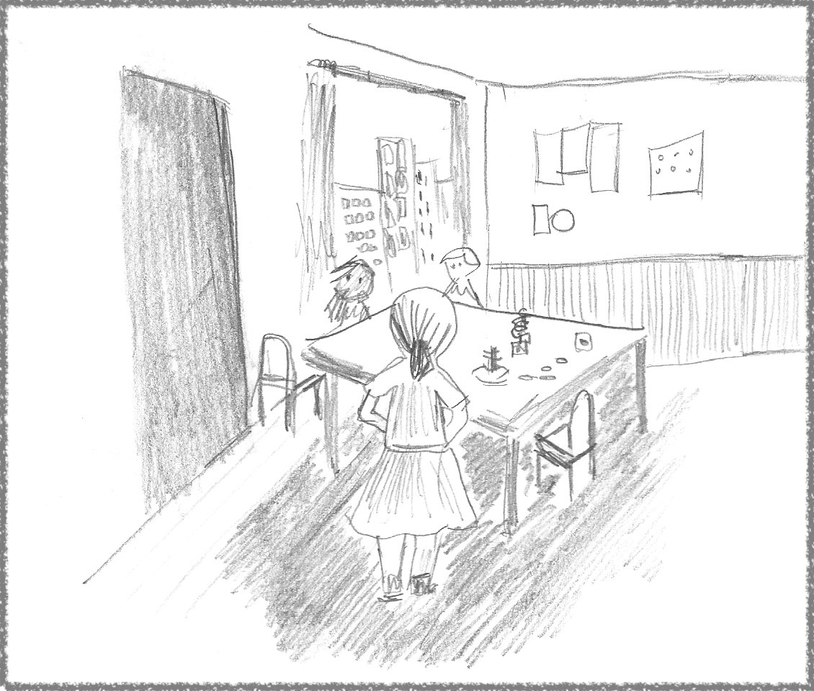

# The Educator Who Taught the World

*The Fantastic Tale of an Italian Giant*

You may know the name, but you may not know the story.

This almost incredible tale starts in 19th-century Italy in the small city of Chiaravalle. A story told many times, familiar to the people of Italy and many working in education circles.

It covers three centuries, four continents, world wars, and influences some of the great thinkers of the 20th century.

This is the story of **Dr. Maria Montessori**, the Italian physician and educator who traveled the world promoting a better way of teaching children.

There was enough struggle, sacrifice, and redemption to fill a novel, but the real story was one of extraordinary determination, thought leadership, resiliency, and strategic thinking.

All in service of a singular mission still changing the world several decades after her death, in 1952.

She did the work of giants.

---

## Determination

Maria Montessori was born on August 31, 1870. She entered technical school at the age of 13, where she studied the closest thing to a STEM program (science, technology, engineering, and math) at the time. She graduated in 1890 with a degree in physics-mathematics —very unusual for women at the time — and decided to study medicine — an even stronger taboo.

She muscled through the rigors of the medical program at the University of Rome, mixed with the smells of formaldehyde and period-characteristic cultural resistance to a woman being part of the program. There, she graduated as a doctor of medicine in 1896, as an expert in pediatric medicine, the first-ever woman to graduate from that University’s program.

Dr. Montessori kept reaching and readjusting goals for over 15 years during her learning years.

I don’t think she could envision the exact outline of her career as an adult, at least at first. Still, the pattern of setting increasingly challenging goals was already evident. It continued throughout her whole life.

---

## Advocacy

It is 1897, and now, *Dr.* Maria Montessori, she continues her research at the University, working as a volunteer assistant at its psychiatric clinic. Towards the last two years of the medical program, Maria learned everything about psychiatry and education and took an interest in children with learning disabilities, inspired by her reading of other educators of the time.

Not only was she uniquely trained and capable in her field, she also started to speak at congresses and conferences. The subjects ranged from population medicine to education methods until they eventually coalesced around the topic of teaching children with learning disabilities.

By 1900, she was a co-director of the Orthoprenic School, *“a medico-pedagogical institute for training teachers in educating children with learning difficulties.”*

In a short four years after graduating from the medical program at the University of Rome, she was not only teaching children with learning disabilities, she had examined the challenges, developed a [method](https://en.wikipedia.org/wiki/Montessori_education) to overcome them, and started to advocate it in earnest, initially traveling around Italy, next to other parts of Europe, and later to North America, South America, and Asia.

In isolation, these would be extraordinary achievements. Still, the dry recollection of facts does not come close to highlighting its historical significance. By 1900, the [Prussian method of education](https://en.wikipedia.org/wiki/Prussian_education_system) had a century-long head start and had already spread throughout the world. At the time, it was the unquestionable incumbent system. Also incumbent was society’s tacit acceptance of neglecting the education for children who could not fit into that system.

One hundred years of institutionalized structures and practices.

At the age of 30, Dr. Montessori was doing remarkable things and had created a name for herself. Still, she was past building a career. She was out to challenge and change the system.

---

## Resiliency

Dr. Montessori was a passionate and convincing speaker. She captivated audiences in packed auditoriums, sometimes in innovative formats like the [“Glass Room” in San Francisco](https://amshq.org/About-Montessori/History-of-Montessori/The-Glass-Classroom).

Widespread attention and admiration attracts strong criticism — remember, the world pushes back — and there was no shortage of skeptics and critics. The most common objection was the requirement for practitioners to strictly adhere to the Montessori method.

That criticism happened on [valid philosophical and ideological grounds](https://rivistadistoriadelleducazione.it/index.php/rse/article/view/10350). Dr. Montessori remained unmoved, concerned that freedom to adapt the method would mean instructors falling back to the prevailing behaviorist approaches of the times.

After Dr. Montessori arrived in the US, in 1913, she toured the country and spoke to sold-out audiences of thousands. In one of those sessions, at Carnegie Hall, she struck the wrong chord for Dr. William Kilpatrick, a disciple of John Dewey, the most prominent educator in America at the time.

Later, in 1914, Kilpatrick published “The Montessori System Examined,” where he set out to explain why the method would be inadequate for the realities of education in the United States, comparing the work of Professor Dewey and “Madam Montessori.” Historians argue that Kilpatrick’s assessment effectively closed the doors to the growing spread of Montessori schools in the country.

The system was pushing back hard.

Montessori schools would eventually return to the US after several decades, spreading even further and becoming synonymous with higher quality education — regrettably, also synonymous with a more expensive form of education, contradicting its humble origins in Italy.

---

## Integrity (or making things right)

Changing the world takes world-size determination. With the territory comes personal sacrifice; in Dr. Maria’s case, there was enough adversity to fill a lifetime.

As a parent, I think the worst started in 1898, when she had a son out of wedlock with her then-partner, Giuseppe Montesano, a fellow doctor who co-directed the Orthoprenic School. The 1900s tolerated only so much deviation from societal norms, and marriage would demand that she abandon her career to care for her new family.

Dr. Giuseppe eventually married another woman, and pursuing her goals forced Dr. Montessori to place their son in the care of a wet nurse. It would be 15 years before they reunited (more on that soon.)

Now, I am not advocating for anyone to favor their career over their family, nor will I judge someone’s circumstance and decision over 120 years ago. What is clear, however, is that effecting change takes a toll, and the price tag matches the scope of that change.

World-sized changes exact life-sized sacrifices, which later demand life-sized reparations. This is where my admiration for Dr. Montessori took on a new dimension: she pulled it off.

In 1913 she reunited with her son, Mario, and in 1929 they cofounded the [Association Montessori Internationale](https://en.wikipedia.org/wiki/Association_Montessori_Internationale) (or AMI.)

I don’t know the details, but that earlier trait of unwavering determination applied to all dimensions of her life: It may have taken over 15 years of inner struggle while focusing her energy on something she believed in. Still, somehow she made amends.

Mario continued his mother’s work, leading AMI until he died, in 1982.

---

## Moral Courage

In those 15 years before reuniting with her son, Dr. Montessori’s advocacy took the global stage. It reached the US with a [helping hand](https://www.montessorieducation.com/blog/alexander-graham-bell-and-montessori) from a famous supporter, no other than Alexander Graham Bell.

Between 1915 and 1936, she redirected her focus to Europe, living abroad in Spain and traveling the continent overseeing programs to deliver the “Montessori method” across hundreds of schools.

In her home country, Benito Mussolini took power in 1922, and soon after, they entered a productive collaboration between 1924 and 1930. The partnership yielded positive results in expanding the Montessori education method in Italy for a few years.

While some may be quick to judge the association with Mussolini, there is another lesson here about the balance between significant change and purity tests. The line delineating the balance can get muddied, and you better know where you stand when it becomes hard to see it.

The association with Mussolini served her cause, and the Montessori method was declared the educational method of the land. By 1930, things started to sour. Dr. Montessori began to advocate for peace and refused to morph her method into a tool for the indoctrination of children with an unquestionable support of the state.

The line would not move.

In 1934, she was forced into exile. In 1936, unable to reuse the Montessori name to support his educational agenda, Mussolini erased her life’s work and her name from Italy.

As if exile was not enough, while on a lecture tour in India later in 1939 — by invitation of Gandhi himself — her trip was interrupted by the very war she advocated against. With Italy allied with Germany in WWII, the British government declared the internment of all Italians in its colonies as enemy aliens.

In a moment of historical injustice, Dr. Montessori, and her accompanying son, are interned in an educational compound. Maybe as a concession to her stature, the British allowed her to receive visitors and continue her work, later allowing her to travel within the country.

While exiled in India, she made the best out of a difficult situation by training thousands of teachers across the country to use the Montessori method.

She would only return to Amsterdam seven years later, in 1946.

Having yielded to Mussolini would have saved her citizenship, been easier on her family, and possibly kept her from years of forced exile in a distant land. While she could not foresee the exact consequences of her decision, there was no doubt the cost would be extremely high.

Still practicing the same determination and resiliency, then in her late 70s, she returned to Italy in 1947 to re-establish the Opera Nazionale Montessori, the heart of her work in Italy.

There was no price for moral conviction. Hers was life-sized.

---

## Ideas Larger Than Life

For a story within the story, I have read a few things about psychology here and there, mainly for research adjacent to other topics. Often, it comes to famous names like Sigmund Freud, Erik Erikson (of “identity crisis” fame,) and one of my favorites, Jean Piaget.

To stay with that one example, Jean Piaget is the father of the first theory of [child cognitive development](https://en.wikipedia.org/wiki/Piaget%27s_theory_of_cognitive_development) and a towering figure in the field of [constructivism](https://en.wikipedia.org/wiki/Constructivism_%28philosophy_of_education%29), an education theory based on integrating experiences with the environment into what one already knows.

To my surprise — remember, not my field — while researching Dr. Montessori’s work, I learned Piaget was the [head of the Swiss Montessori Society](https://www.montessori.org.nz/montessori/a-brief-history/#:~:text=One%20of%20the%20most%20important,of%20the%20Swiss%20Montessori%20Society.) and was [inspired by her work](https://montessorifortoday.com/similarities-and-differences-between-montessori-and-piaget/#:~:text=Jean%20Piaget%20was%20a%20Swiss,Montessori%20Society%20for%20many%20years.). Many others were.

Over seventy years after her death in 1952, Montessori’s work and ideas are still very much alive.

As an **individual**, she is a beloved historical figure in her home country and abroad. As an **educator**, the method carrying her name became a synonym with a better alternative to the traditional school system and is in use in over twenty thousand schools worldwide. As an **executive** who successfully managed her succession plan, her AMI legacy has a global reach of training centers across nearly 100 countries.

At the conclusion of our story, we find tireless determination in support of a unique combination of scientific method and political ability.

This is even more impressive when we consider that she tackled challenges at the periphery of society’s attention span, where others saw the impossible, the impractical, and the inconvenient.

If you are ever in need of a good story to tell, now you know the tale of one of the most understated and influential figures of our time.

She moved the world.

---

## References

* [Wikipedia: Maria Montessori](https://en.wikipedia.org/wiki/Maria_Montessori)
* [Teacher of the Unteachable: The life and method of Maria Montessori](https://youtu.be/QCA7nngTVp4)
* [The Montessori Method Examined](https://ia600202.us.archive.org/32/items/montessorisystem00kilprich/montessorisystem00kilprich.pdf)
* [Maria Montessori, John Dewey, and William H. Kilpatrick](https://docs.lib.purdue.edu/cgi/viewcontent.cgi?article=1284&context=eandc)
* [A Moment In Montessori History: Maria Montessori’s internment in India (1947)](https://youtu.be/Jvl48dEGAmw)
* [Similarities and Differences Between Montessori and Piaget](https://montessorifortoday.com/similarities-and-differences-between-montessori-and-piaget/)
* [The Maria Montessori No One Knows: A Heartbreaking Betrayal — Part 1 of 2](https://www.clanmore.ca/2012/08/31/the-maria-montessori-no-one-knows-a-heartbreaking-betrayal-part-1-of-2/)
* [Alexander Graham Bell and Montessori](https://www.montessorieducation.com/blog/alexander-graham-bell-and-montessori)
* [History of Montessori](https://amshq.org/About-Montessori/History-of-Montessori)
* [Maria Montessori, pedagogical orthodoxy, and the question of correct practice (1921–1929)](https://rivistadistoriadelleducazione.it/index.php/rse/article/view/10350)
* [Was really Maria Montessori the first woman to become a doctor in Italy?](https://medium.com/age-of-awareness/was-really-maria-montessori-the-first-woman-to-become-a-doctor-in-italy-1bb1d4166d8c)
* [Maria Montessori: una vita per i bambini](https://www.imdb.com/title/tt1034048/) (TV Movie)
* [Maria Montessori and the Nobel Peace Prize](https://www.montessoripublic.org/2022/05/maria-montessori-and-the-nobel-peace-prize/)
* [Montessori Preschool Elevates and Equalizes Child Outcomes: A Longitudinal Study](https://www.frontiersin.org/articles/10.3389/fpsyg.2017.01783/full#h1)
* [Timeline of Maria Montessori’s Life](https://montessori-ami.org/resource-library/facts/timeline-maria-montessoris-life)

---
