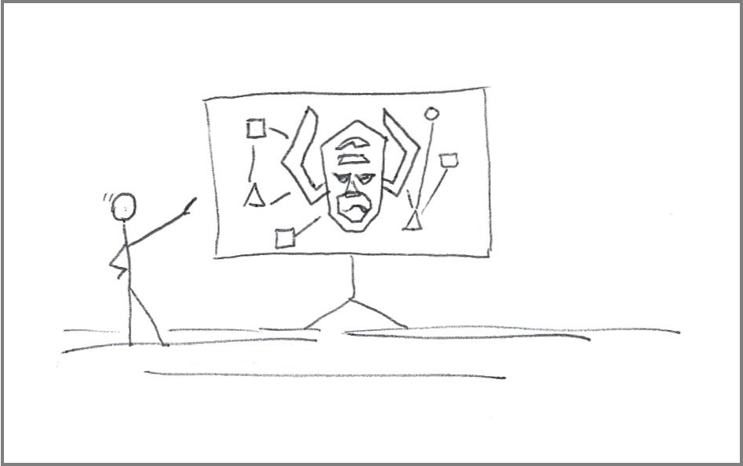

# What is the hardest thing in software development?

_Naming, but not in the way you think_

Phil Karlton once said, _“there are only two hard things in Computer Science: cache invalidation and naming things.”_

One is a real problem; the other is a problem of defining reality.

A misbehaving cache algorithm compromises the system’s integrity. Inadequate names can compromise the system’s entire existence.

On the surface, this may seem like quite a leap. Still, it makes sense when you look into how we learn and build a shared understanding of the world.

Our knowledge comes from experiencing and interpreting the reality around us. With software, we build worlds, virtual ones. I don’t mean virtual worlds in the sense of meta-universes. I mean virtual worlds in our minds.

We build new worlds because reality is filled with, well, everything. When representing a real-world experience in a virtual world, that construction process goes through three distinct phases:

1. Replicate the experience or activity as-is.
2. Identify and remove extraneous steps and tasks that do not contribute to the experience
3. Add helpful features that do not have counterparts in the physical world.

Take online shopping as an example.

That online experience incorporates many aspects of reality, such as browsing items and paying for them. Other concepts, such as driving to the store, add no value and are not included in the virtual experience. And then there are concepts only useful — and possible — in the virtual world, such as storing a credit card number for future purchases.

As we build those new realities, we must first invent things and then name those things. An unclear, unconventional, or insufficient perception of reality results in confusing names.

Confusing names make it difficult to share the knowledge beneath those names. Without enough people sharing the same interpretation of reality, systems invariably fail.

This topic gets philosophical before it gets technical.

---

## The semantics of reality

Before understanding why naming is hard (and crucial), we must understand how our brains “translate” the world around us into knowledge.

More than sequences of symbols and sounds, names represent concepts in what psychologists call a [schema](https://www.verywellmind.com/what-is-a-schema-2795873).

Schemas can be a little abstract for software development, so I prefer to use a particular form of schemas called [semantic networks](https://en.wikipedia.org/wiki/Semantic_network).

The simplest form of semantic network contains entities and relationships:

* An **entity** represents a distinct artifact type, whether actual or conceptual. If we are talking about trees, some recognizable entities would be “trunk,” “branches,” “leaves,” “fruit,” “flowers,” and “seeds.”
* A **relationship** describes the association between two entities. For example, a leaf “connects to” a branch, and fruits “grow from” trees.

 identify and connect entities. Semantic networks become increasingly denser as we learn more about a subject, with new entities continuously added to the network. Our brains also reorganize those networks as we learn more about a topic.")

While a semantic network represents the world, there are different and equally valid representations. Some representations differ in **depth** (seeing the world in more detail,) and others differ in **perspective** (seeing the world from different angles.)

Let’s start with an example of teaching someone about the origins of fruits.

A toddler asking about the origin of fruits may be content with a simple semantic network of “trees,” “branches,” “flowers,” and “fruits.”

Later in life, perhaps as a biology student, that same student will be ready to understand a more complex model. That model will have new entities, such as “seeds,” “pollen,” “pollen tubes,” “ovaries,” and “pollen sacs.” These new entities will demand more semantic network relationships, connecting pre-existing and new entities. For example, pollen “resides in” a “pollen sac,” and a pollen sac is “part of” a flower.

These two semantic networks differ in **depth**.

Apiologists — experts on honey bees — examining trees certainly have many of those concepts in their semantic networks. However, the semantic networks may include less common entities, such as “forest buffers” and “windbreaks,” relating to bees’ livelihood and general viability in an ecosystem. Those semantic networks still contain extra information about trees, but only when that information is related to bees.

That is a difference in **perspective**.

These differences introduce two fundamental challenges in dealing with reality, which you may start to recognize in software development:

1. _Different skill levels mean different depths of semantic networks_. Some people can see more nuance in a customer scenario than others. It does not mean the extra perception will always have a material effect on the final solution, but it is there.
2. _Different priorities influence how we classify the same sensory information_. Software developers may recognize entities that underpin the entire system in a complex physical and logical web of servers, connections, and rendering engines. For the user, maybe all they see is “an app,” a minor entity in their daily routine.

We are more or less familiar with differences in depth. We are not as adapted to differences in perspective.

---

## A virtual world where everything is new

At this point, you can tell the hard part is not the final act of naming something.

Beneath a good name lies a clear perception of reality and the formation of a semantic network. Concepts and relationships must emerge from observation before we can name them.

At some point in recorded history, someone must have looked at a tall stick on the ground and called it a tree — To be accurate, they called it [something else](https://www.etymonline.com/word/tree).

But what happens when someone’s reality does not obey the rules of space, matter, and time?

That is the software conundrum, emphasis on “soft” (virtual) as opposed to “hard” (concrete.) Software developers don’t simply assign names to entities in their world. _Often, they create those entities._

As such, software developers face naming decisions more frequently than people in other professions.

To use a few examples of how other professions come across the challenge of naming a new thing, we must look at _how often_ they come across new things.

Physicists need to dissect the foundations of the universe using instruments that peer into the depths of subatomic particles. Astronomers look far and wide using limited resources, hoping to discover an [object that needs a new name](https://www.iau.org/public/themes/naming/). Entrepreneurs must create companies and new products before they can name them.

The theme is clear: lots of work, long discovery periods, real-world constraints, and maybe the top of their respective field gets a handful of naming opportunities every year (or decade.)

Software developers? They get that opportunity dozens, possibly hundreds of times a day.

The opportunities come from dealing with a medium that can represent thoughts and concepts in a program. Those representations must be rigidly and unequivocally referenceable by other programs.

---

## Knowledge transfer, from theory to practice

Once everything new is named, it is time to introduce those new worlds to the rest of the development team.

With most software developers lacking a formal background in education, they often rely on a combination of their experiences in **learning from** and **teaching** others.

While formal training in teaching may be a distant possibility, we can at least skim through some aspects of [learning theory](https://en.wikipedia.org/wiki/Learning_theory_(education)).

A deeper analysis of learning theory deserves its own posting. Still, even a quick read through a concept such as “transfer of learning” shows the potential to explain and improve upon traditional methods of sharing software designs.

It is worth noting that these traditional methods should still be the foundation for any knowledge transfer:

* Design documents
* [Component diagrams](https://www.uml-diagrams.org/component-diagrams.html)
* Terminology dictionaries
* [Interaction diagrams](https://www.ccs.neu.edu/home/futrelle/teaching/com1204sm2002/uml/interaction/interactions.htm)

Pause to note that **whiteboarding sessions** are complementary to design documents, not a substitute.

To be clear, a live session is a great cognitive tool. “Students” can interact with the “instructor” to probe concepts and gradually augment their semantic networks.

On the other hand, training delivery largely depends on the instructor’s experience. A personal delivery leads to inconsistent results across sessions. Individualized delivery also scales poorly and marginalizes colleagues outside the boundaries of social networks, geographies, and time zones.

---

## Metaphors: Beware the “off-the-shelf” semantic networks

Different people form semantic networks in different ways. In software development, that is especially true of situations where you deal with abstract concepts fitting multiple possible categories.

It is no surprise that designers and developers now and then favor [using metaphors to model or describe their systems](https://www.linkedin.com/pulse/role-metaphors-software-dale-stephenson). The thinking is that metaphors can expedite knowledge transfers by building upon similar semantic networks people have already previously learned.

An example of a simple metaphor is using a “trash” icon to delete files from a computer. A more elaborate example of a metaphor is the co-opting of the concept of “queues” in messaging systems.

There are (at least) two problems with using metaphors, though.

### Metaphor issue #1: Well-known by whom?

The first problem is that a familiar concept is not necessarily universal.

A perfect example comes from a Star Trek episode called “[Darmok](https://memory-alpha.fandom.com/wiki/Darmok_(episode)).”

The example is perfect because Star Trek fans already understood what I meant, and nothing else needs to be said. Meanwhile, non-fans are left wondering why that episode is meaningful.

In that episode, an alien race communicates through metaphors rooted in historical events in their homeworld, in a planet-wide version of an inside story. As a result, communication with any other society was hindered by the lack of a shared context, leading to long and fruitless attempts at contact.

On a side note, the story also shows the incredible power of shared context, where minimal verbal cues can quickly convey densely packed information.

_Sokath, his eyes uncovered!_

### Metaphor issue #2: Depth and perspective

Once again, we face our semantic network villains.

If I say something “works like the Internet,” technical people may know more or less about the Internet. At the same time, some Internet power users without a cloud infrastructure background may see it as a [series of tubes](https://en.wikipedia.org/wiki/Series_of_tubes).

Even within a technical community of cloud infrastructure engineers, some people may have never heard of [BGP (Border Gateway Protocol)](https://en.wikipedia.org/wiki/Border_Gateway_Protocol) until [Facebook’s massive outage in 2021](https://en.wikipedia.org/wiki/2021_Facebook_outage). And people like me, who had just learned about BGP from reading articles at the time, may have added BGP to their semantic networks as some loose version of \[that protocol connecting big companies to the public Internet.\]

There is also evidence from learning theory that [transferring knowledge across different experiences](https://en.wikipedia.org/wiki/Learning_theory_(education)#Transfer_of_learning) is not a universal skill:

> Transfer of learning is the idea that what one learns in school somehow carries over to situations different from that particular time and that particular setting… He found that though transfer is extremely important for learning, it is a rarely occurring phenomenon.
>
> In fact, he held an experiment where he had the subjects estimate the size of a specific shape and then he would switch the shape. He found that the prior information did not help the subjects; instead it impeded their learning.\[17\]

---

## Abstractions. It is abstractions (almost) all the way down

Think of abstractions as grouping entire semantic networks into fewer entities in a new semantic network.

An abstraction enables higher-level communication, whether between humans or between humans and machines.

As an example of a real-world abstraction, think of online shopping, where the buying experience is represented with images and buttons on a computer screen.

While abstractions are not unique to software, the software industry is unique in how quickly it stacks abstractions on top of abstractions. That stacking creates inscrutable layers of semantic networks requiring steep learning curves.

To illustrate how “tall” those software abstraction stacks can get, let’s attempt to explain a **Kubernetes cluster** to a layperson:

_A Kubernetes_ **_cluster_** _groups various Kubernetes_ **_nodes_** _into a logical computing unit with the aggregate computing capacity of those nodes. A Kubernetes node is an abstraction for computing capacity, which could be a_ **_virtual machine_** _running on a_ **_hypervisor_**_, an actual_ **_bare-metal_** _server, or even a tiny rack of_ **_Raspberry Pis_** _sitting on a desk._

_You can run a program on a Kubernetes node. But first, you need to understand the abstraction of “_**_pods_**_,” which are groups of “_**_containers_**_” deployed together._

The explanation could continue until it inevitably overwhelms one’s ability to extend their semantic network.

The takeaway here is that **simpler does not mean simple**. Some technologies are inherently complex because they solve complex problems.

And because we need to reason and communicate efficiently about the solution to those problems, we keep layering abstraction atop abstraction until explanations feel a lot like the now-famous tale of the “[turtles all the way down](https://en.wikipedia.org/wiki/Turtles_all_the_way_down).”

Software developers, or at least software architects, would do well to skim the concepts of [Cognitive Load](https://en.wikipedia.org/wiki/Cognitive_load) — The topic of cognitive load applied to software design is the subject of a future posting.

---

## From ubiquitous to unique

Semantic networks grow in number and size as we learn. They also grow like trees, with new concepts attached to existing ones. We can reorganize portions of semantic trees in our brains, but complete “rewrites” are not easy or common.

The semantic networks for two individuals may converge closer at their cores, especially when those individuals share a lot of contexts.

As abstraction levels go up, that shared context wanes, and those semantic networks become increasingly different at the edges. When those networks become sufficiently different, those individuals no longer share similar points of view.

As a warm-up exercise in software development, let’s look at the narrow scope of naming variables inside a function. The semantic networks inside a function are very limited in purpose, with programmers attempting to fit the names to a localized control loop or portion of an algorithm.

Loop controls require naming index variables or enumerated elements. Those naming decisions are largely derivative and inconsequential. For example, when it comes to index variables, the default decision often follows the [historical pattern](https://news.ycombinator.com/item?id=1971507) of single-character names like “**i**,” “**j**,” and “**k**.”

Move past loop controls, and we are dealing with naming entities with a higher semantic purpose. At that point, we are probably trying to make the names fit within the purpose of the function containing the variables.

As the naming exercises move up in the hierarchy of concepts, we start aligning names with system concepts. For example, if a system has a component representing a shopping cart, we will probably have a file or a system class named in a way that resembles shopping carts.

The important thing here is that different people create different semantic networks for the same reality. When that reality is very narrow, such as “loop through this array,” the semantic networks are equally limited and tend to align perfectly.

As the scopes gradually widen (control flows, modeling an algorithm as programs, or defining a system,) the alignment erodes in direct relation to that scope.

When we consider alignment with the mental models for how a _customer_ sees the system, the word _alignment_ cannot begin to cover the gap. What constitutes the center of our world and expertise may be simply “application number 3 from vendor number 6” for a customer.

Returning to our shopping cart example, would two different programmers make the same decisions about representing shopping cart functions as source code files? Probably not.

More importantly, would they agree with someone else’s decision and adjust their mental models? Possibly.

Agreement means “aligning” semantic networks across different people on the team, and there are some good techniques for it. Some formal methods were mentioned earlier (design documentation, dictionary of terms, component diagrams, sequence diagrams.)

I would add frequent cross-education and even pair programming as activities that can supplement formal documentation.

**Update on Jan/3**: Discussing methods to increase “semantic agreement” across a development team — such as [Business Analysis](https://en.wikipedia.org/wiki/Business_analysis), [Domain Driven Design](https://en.wikipedia.org/wiki/Domain-driven_design), or [RUP](https://en.wikipedia.org/wiki/Rational_Unified_Process) — is another topic for a future posting. I intentionally left these processes outside this discussion. These processes require creating business and domain models of reality, bringing us back to the same challenges already addressed in this posting.

The topic of differing semantic networks takes us to the next section.

---

## Rewriting reality through code

Redoing someone’s work is a uniquely common practice in the software industry.

Rework is, at first glance, a wasteful activity. On the surface, and perhaps from the perspective of a project manager, if a block of code is doing its job, developers should leave it alone. If a block of code needs minimal modification to add a new feature, it should make more sense to augment that component with the deltas and leave the rest untouched. Right?

The disconnect here is that project managers are thinking of building things. Instinctively or by training, project managers expect that when you build something in the real world, it is done.

However, once again, software developers are not building things in the real world; they are interpreting reality to _create a virtual world_.

Leaving aside legitimate reasons for [code refactoring](https://www.techtarget.com/searchapparchitecture/definition/refactoring), a software developer “inheriting” codebases from another developer may still feel the urge to rewrite significant portions of that codebase.

Why is that?

In a word: [**constructivism**](https://en.wikipedia.org/wiki/Constructivism_(philosophy_of_education)).

In a few more words, pre-existing code in a system is not a static artifact. It is an interpretation of reality. In a virtual world, make that a _changing_ reality. Under those conditions, reaching a shared, stable understanding of reality across the team is almost impossible.

Rewriting code is not a pointless exercise in rebuilding what is already in a code repository. It is an exercise in creating an equilibrium between what the developer knows and the written representation of that knowledge. That alignment enables the developer to work with the code base more productively. The rewritten code base _is a byproduct of a learning activity_.

Note that I explicitly address a scenario where the codebase is transferred from one developer to another. [Code ownership](https://wiki.c2.com/?CodeOwnership), whether following an individual or a shared model, is a topic for a future posting.

I could not end this section without the tie-in to a naming exercise. After completing a code-rewriting activity and forming new semantic networks to represent their interpretation of the world, the odds of that developer choosing the old names for the new concepts are relatively low.

Ego may play a part — naming things is akin to leaving a small mark in the world — but there is at least one very pragmatic reason for it: A new concept with the old name is bound to confuse people familiar with the old concept — See this excellent session on the topic of [spreading activation](https://www.khanacademy.org/test-prep/mcat/processing-the-environment/cognition/v/semantic-networks-and-spreading-activation) for reference.

New realities beget new names.

---

## Conclusion

Naming (something) in software development is the culmination of a complex process of creating abstract worlds.

Some portions of those worlds are direct representations of the physical world, while other parts are entirely new.

The naming process includes narrow tasks (writing a short control loop) and broad cognitive exercises (creating new abstractions.)

The lack of historical references — software development is a relatively new discipline — requires the frequent deployment of imperfect metaphors to explain new paradigms.

Unprecedented technological progress demands ever-increasing abstraction layers to stratify the mind-boggling capacity of modern systems into layers.

Many of these challenges are intrinsic to the young age of our profession, but there are various concepts we can borrow from other fields to help us explain, reconcile, and solve those problems.

---

## References

* Metaphors We Compute By — [https://websites.umich.edu/~jlawler/meta4compute.html](https://websites.umich.edu/~jlawler/meta4compute.html)
* What Are Abstractions in Software Engineering with Examples — [https://thevaluable.dev/abstraction-type-software-example/](https://thevaluable.dev/abstraction-type-software-example/)
* Semantic networks and spreading activation — [https://www.khanacademy.org/test-prep/mcat/processing-the-environment/cognition/v/semantic-networks-and-spreading-activation](https://www.khanacademy.org/test-prep/mcat/processing-the-environment/cognition/v/semantic-networks-and-spreading-activation)
* Navigating through the Everyday World — A Cognitive Perspective by @DonnaRobertsPhD — [https://link.medium.com/T9SHda0mWvb](https://link.medium.com/T9SHda0mWvb)
* You can handle complexity. So what? — [https://medium.com/@hayavuk/you-can-handle-complexity-so-what-41f0aca4d097](https://medium.com/@hayavuk/you-can-handle-complexity-so-what-41f0aca4d097)
* Code Ownership — [https://medium.com/blacklane-engineering/code-ownership-177566d93378](https://medium.com/blacklane-engineering/code-ownership-177566d93378)

---
