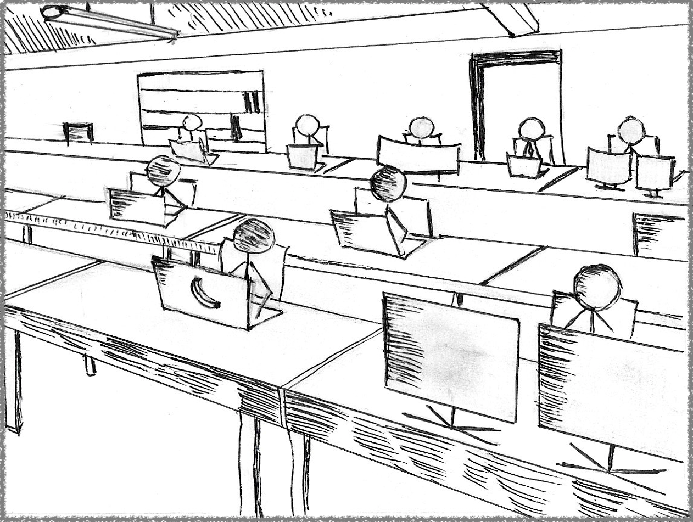
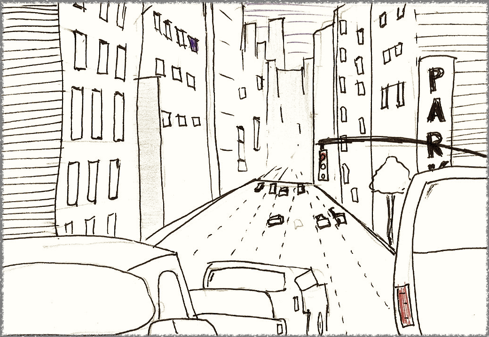

# Return to the Office Without Returning to The Past

_A Comfortable Place Is Not Always the Right Place_

The [pandemic is over](https://www.who.int/news-room/speeches/item/who-director-general-s-opening-remarks-at-the-media-briefing---5-may-2023) and it is time to return to normal.

And in the business world, that normal includes the traditional office.

But why?

Step away from conspiracy theories of power plays and real estate valuations, and you will find two simple reasons rooted in psychology and neuroscience:

1. When things become hard to navigate, we tend to [seek familiar surroundings](https://www.encyclopedia.com/psychology/dictionaries-thesauruses-pictures-and-press-releases/beyond-pleasure-principle).
2. [We don’t remember things the way they were](https://www.ncbi.nlm.nih.gov/pmc/articles/PMC9241447/). We remember the way we felt about those things.

What can be more challenging to navigate than improvised work arrangements imposed by death, panic, and lockdowns? Which period brings out the worst memories of recent times?

None of this means returning to a point in space will bring back those years, but like a crashed system, it is only human to revisit the past, hoping to find a stable snapshot and restore what was lost.

Speaking of my corner of the corporate world, in software development, we adapted better than most to the partial lockdowns, not the least because we normally excel in that [twilight between the virtual and the real](https://dnastacio.medium.com/real-to-virtual-b2bacd2423c9).

It was still improvised, and it was still a pandemic.

The flexibility of working from home paled compared to everything else lost between 2020 and 2022. Beyond the obvious death toll, there were also layoffs, school years, and [sanity](https://www.kff.org/mental-health/issue-brief/the-implications-of-covid-19-for-mental-health-and-substance-use/#:~:text=Symptoms%20of%20anxiety%20and%20depression,compared%20to%20their%20male%20peers.).

Then, 2022 brought about a rollercoaster of [irrational exuberance](https://www.investopedia.com/terms/i/irrationalexuberance.asp) in hiring followed by more layoffs. At some point, anything pre-2020 started to look like a golden era.

There may be sound reasons for returning to traditional offices. Still, some arguments around engagement, networking, and mentorship are missing significant cultural and technological shifts underway before COVID-19 struck.

Before getting into those, let’s start with the giant elephant in the conference room.

---

## Slack: We Hardly Knew Ye

The pandemic kickstarted an unprecedented experiment in the workforce worldwide, generating something I did not think we would see back in our (professional) lifetimes: **slack.**

No, not the [collaboration platform](https://slack.com/); we saw plenty of that. I mean “slack” in terms of unassigned resource time in a project.

Suddenly, people were not commuting anymore. Taking the United States (of America, for those reading from abroad) as a reference, where the [average one-way commute is a little shy of 30 minutes](https://www.census.gov/newsroom/press-releases/2021/one-way-travel-time-to-work-rises.html), and assuming ten trips over five days a week for in-office work, we had an extra _five hours_ in our hands every week.

Five hours no longer spent on something [scientifically proven to be a significant stressor](https://www.psychologytoday.com/us/blog/urban-survival/201501/commuting-the-stress-that-doesnt-pay) on daily routines. Gone.

Shortly after the initial productivity shock of lockdowns, we realized the slack went beyond those five hours because we could shuffle our routine around [flow states](https://en.wikipedia.org/wiki/Flow_%28psychology%29).

Once school closures stopped being the norm, a share of the WFH population also experienced a newfound ability to outperform on tasks that required deep focus and concentration: Fewer unplanned interruptions!

More work done. More slack.

And before we write off commute time as a shrug-worthy chore that can be filled with audiobooks and podcasts, we should get into the _math of disposable versus usable time_.

It is easy to rationalize the average five hours of commuting as a small percentage of a typical week, with 168 hours spread across seven 24-hour days, amounting to a mere 3% (5/168) of that total.

However, take weekends (48 hours,) work week sleep (40 hours,) and working hours (40?) from the denominator, and those five hours suddenly become 12.5% (5/40) of the total.

Continue that exercise, removing other fixed costs attending to unavoidable personal chores, reusing some data from the [U.S. Bureau of Labor Statistics](https://www.bls.gov/home.htm), and those **hours start to represent anywhere from 20% to 50% of the leisure time for a working adult**, depending on whether they have children and the children’s age.

So, while RTO may just be a return to a pre-pandemic normal, it is still a massive shock to present-day professional and personal routines.

**Net:** There are concrete reasons to try and extract the benefits from in-person collaboration _from fewer days in the office._ Credit to [most RTO policies](https://www.levels.fyi/remote/), they seem to acknowledge that fact with hybrid arrangements of 2–3 days per week in the office.

---

## Uneven (Virtual) Reality

In the tech world, for better or worse, we are conditioned not to hold on to processes or tools. Our past is an undesirable and uncompetitive space, littered with underpowered hardware, slow connections, and gray walls.

In tech, there is no normal. There is no familiar.

So, why return to the old ways? Why not work from home — or away from the office — all the time?

We often get lost debating issues of convenience and flexibility — because they still matter — but we don’t arrive anywhere because reality is not evenly distributed.

Sure, at least personally, the coffee at home is better, the hours more flexible, and the commute infinitely shorter.

That is not the case for everyone.

For every person [fortunate enough to be able to afford a dedicated home office](https://www.angi.com/articles/home-office-costs.htm) unperturbed by kids in grade school, there may be someone taking a phone call ensconced in a broom closet while young children pay loud tribute to their Summer break.

For every seasoned professional who can [work more productively without interacting with others in person](https://medium.com/codex/visiting-an-office-really-is-a-time-wasting-exercise-c85d1836487), there is a junior engineer who could benefit from polishing their social bonafides and [making essential connections](https://twitter.com/mipsytipsy/status/1693412071051002094) that will help them later in their careers.

We will not find common ground in the anecdotes. They line up dangerously close to demographic boundaries, where [here be dragons](https://en.wikipedia.org/wiki/Here_be_dragons) and significantly different outlooks in life.

From the sidelines, we also have to contend with a growing mental health crisis, where [employers and employees need to be better prepared to navigate those conversations](https://www.forbes.com/sites/glebtsipursky/2023/07/21/the-mental-health-crisis-caused-by-the-return-to-office/?sh=107efa08414c).

I am threading a needle of [bothsideism](https://en.wiktionary.org/wiki/bothsidesism) here, but that is the whole point.

This debate will not be won with a decisive data-driven knockout, mainly because the little data we have reveals a more nuanced picture, with some segments of the office population reporting improved mental health post-RTO.

So, the current point in time is inconclusive, but as the following section shows, those demographics are pointing in a clear direction.

---

## The (Generational) Point of No Return

[RTO is a centuries-old cyclical phenomenon](https://theconversation.com/a-short-history-of-the-office-82000).

In the long run, it is all about colocating the tools and materials required to do the work in a way that makes it possible and efficient, in that order.

Technology in software development moved in flash steps, steadily advancing through decades of exponential progress.

It is one thing to _adapt_ to changes; it is another thing entirely different to experience the _formative years_ of your career with a different reality.

In the early 80s, everything needed for software development was hugely expensive, large, and wired to the building — Say hello, fellow [Gen Xers](https://en.wikipedia.org/wiki/Generation_X).

Fast forward to the early 2010s, and remote work became possible and reasonably seamless right before [Gen Zers](https://en.wikipedia.org/wiki/Generation_Z) started joining the workforce.

By then, broadband Internet access was fast enough to make Cloud computing accessible from a home office, collaboration tools were much better, and teams had (somewhat) learned to cooperate across geographies and timezones.

Widespread video-based cooperation did not become an enterprise reality until the late 2010s, with Zoom and WebEx — They started much earlier, but the large-scale enterprise readiness came later.

Why the recap?

Because direction matters more than the stops along the way.

The software developers starting their careers in those early remote-ready years are now in their late 20s and early 30s. [Statistically](https://www.zippia.com/software-engineer-jobs/demographics/#age-statistics), that remote-first generation of tech workers is still a minority, around 20% of the market.

But it is not only a significant minority. It is a fast-growing group, both in size and influence.

_Within a decade, that share of the workforce forged in a new reality of unfettered access to information will cross the majority threshold, including the C-suite._

That generation of business leaders will be uniquely adept to a remote-first environment of sophisticated collaboration tools and be socially optimized for efficient cross-geo, cross-timezone cooperation.

While I also worry about the long-term effects of human communication over two-dimensional small screens, the near future is already pointing at [virtual life-sized 3D interactions](https://blog.google/technology/research/project-starline/).

Look forward just a little bit — years instead of decades — with the unlimited possibilities of reality augmentation powered by conversational AI, and in-person communication will inevitably become the less efficient, less fluid form of interaction.

**Net:** Observe and learn the communication patterns and preferences of Millennials and Gen Zers before making the case for the best balance between face-to-face and online communication.

---

## Information Sharing Over Interactions

If you need complex information that only a colleague has in their head, face-to-face interaction and easy access to a whiteboard is the standard to beat.

One must step away from that ideal scenario and consider the reality of geographically distributed teams anchored around collaboration tools.

1. _Essential information should not be in the heads of a single colleague._ Knowledge hoarding, intentional or not, is a form of holding people’s productivity back, and organizations should optimize for forms of communication where that arrangement is short-lived.
2. _In-person communication kills knowledge accumulation_. Unless the person receiving the information proceeds to document what they learned, that means people in other offices will not have access to the privileged knowledge.
3. _In-person communication excludes people in other time zones_. No matter how hard you try, capturing an in-person session that explores the _full range_ of expression of the in-person medium is virtually impossible.

We hear a lot about “remote first,” but what matters most is “online first.”

Before the Internet, we had to read manuals from cover to cover or struggle.

My first software development lab had a small library of technical books attached to it. The knowledge had to be in our heads, and [RTFM](https://www.cyberdefinitions.com/definitions/RTFM.html) was the law of the land.

Today?

I can hit Stack Overflow and get my answer in seconds. And it is not only the answer. Spending a few extra minutes reading the comments section — the true gold of the Internet — surfaces all sorts of alternative solutions, with the where and how they would work better or worse.

As a result, I can operate at a higher cognitive level. We all can. For lower-level information, we only need to fetch some keywords from those higher-level contexts and put them in a search field.

As a side note, for narrower questions where we need a snippet of code, there is always generative AI, such as ChatGPT. They may hallucinate a parameter or two but are borderline magical with Python code and CLIs.

Could you ask those questions to someone sitting next to you? Yes.

Will it get better business results? [Absolutely not](https://twitter.com/dnastacio/status/1589639220372520960).

**Net:** Focusing on the quality of one interaction obscures the focus on the frequency, nature, and quality of _all_ interactions.

---

## Manage The Work First

People’s productivity ebb and flow with the nature of the project, assignment, personal issues, availability, and so many variables.

_“But how can you tell whether someone is delivering results?”_

Not by looking at them.

I have never been a people’s manager, but I have plenty of experience as a technical leader. In that sense, I am used to defining a technical solution and breaking it down into the tasks required to deliver it.

That breakdown also includes an assessment of the task’s complexity and the potential time it would take if assigned to someone experienced enough to take on that task.

Managing the work is my only recourse to keep things on track.

Is the work clear? Is it understood? Is it assigned to someone with enough technical skill to execute it? Is it being completed to the project standards? Does it meet customer requirements? Is it late?

These are the questions I can ask.

Does someone understand work better than others? Is the task owner taking longer than I would consider a reasonable time? Does their work environment allow them to focus on the work? Are they working on the task as much as I think they could?

These are questions I cannot ask. I eventually learned I was better off that way. Not being a people manager, a technical leader needs different tools to get the most productivity from a team.

Incidentally, the best productivity lesson I ever learned on the topic started with reading Peter Drucker’s [“Management Challenges for the 21st Century”](https://www.google.com/books/edition/Management_Challenges_for_the_21st_Centu/NpkJTf0lZhUC?hl=en) many years ago, from where I quote:

> In the knowledge economy, everyone is a volunteer \[…\] Accept the fact that we have to treat almost anybody as a volunteer.

While that may sound a little like letting everyone do whatever they want, or letting people not do anything at all, that mindset means you must define (and sometimes steer) the work toward things that attract people. It also means talking to people and asking them what interests them the most.

Personnel aspects can obviously ruin the business if left unattended, such as interpersonal conflicts, unmet career aspirations, life-changing events, compensation, and many others. Good people management still matters. And it matters more than ever if we will make the best out of hybrid office policies.

**Net:** When it comes to productivity — and acknowledging _I am biased by my professional career choices —_ managing the _work_ is often more effective than managing the people doing it.

---

## Serendipity, You Say?

Serendipity in forming ideas is often cited as an advantage of in-office collaboration.

Supporters often tell stories of how people have randomly bumped into each other on the way out of a cafeteria or coffee shop, struck up a conversation, and came up with great ideas.

Ignoring the effects of [personality traits in serendipity encounters](https://informationr.net/ir/25-4/isic2020/isic2001.html), which may be experienced in very different ways across the office-dwelling population, the flaw in the in-office serendipity theory comes down to numbers.

Access to information (and people) today is not only better than it was three decades ago, it [enables communication patterns that simply did not exist](https://link.springer.com/article/10.1007/s10115-021-01552-w).

_The breadth of knowledge around the cafeteria or coffee shop is infinitesimally smaller than what is available online._

That is not a diss toward my nearby colleagues; I also include my knowledge in that pool. It is just a fact that the online world has a much larger and more diverse population than you can find in a single building.

Watching a few key channels in something like a corporate Slack or Teams channel will always be more effective in mining (and generating) ideas than hoping to bump into a similar spark from someone living within driving distance of the building.

And those online exchanges are not low-quality interactions. They are rich, augmented with in-context lookups, and filled with links and referrals.

Yes, meeting the people on the other side of those chats in person would be fantastic, but that is beside the point, as we would not have met them in the first place.

Most of my favorite professional colleagues live hundreds, often thousands of miles from my office — I am sure some of yours, too — Some live in different countries. And I may never meet them in person.

**Net:** [Create conditions for collaboration](https://hbr.org/2011/02/make-serendipity-work) first, actively encourage people to understand the [difference between intention and luck](https://medium.com/@ameet/the-four-kinds-of-luck-ea729970d71d), and then push people to look for serendipity in ways that work best for them. Then, periodically, find ways to gather those people in person, using group events and planned activities.

---

## We Are Here. Make It Count

The current reality of how the workforce relates to the traditional office is mixed.

The future direction is not.

There is nothing wrong with wanting face-to-face, [high-quality interactions](https://www.forbes.com/sites/lbsbusinessstrategyreview/2021/10/25/why-do-we-have-face-to-face-meetings/?sh=491355231f07), easy access to information, supporting new colleagues in person, and putting human faces to inhuman avatars in chat rooms.

And it is precisely because these things _are_ important that we need more than hoping they will happen when we put people physically next to one another.

We need purpose. We need intent. We need new forms of collaboration — and management — adapted to the reality of in-person collocation being an expensive arrangement.

Office collocation is a near-luxury item that should not be avoided altogether but also not be used in the same ways, or as frequently as we did ten, twenty, or thirty years ago.

Moving forward means isolating the good things we expect from RTO and adapting them to the realities of evolving technology and shifting demographics across a society coming to terms with life-altering events.

The buildings may be familiar, but the pandemic was a difficult time of extreme adaptation and, in many cases, isolation.

For now, returning to the office and seeing more faces offers a welcome respite to the latter and an opportunity to reexamine the former.

With concerted effort, we may bump into the best blend of pros and cons between the opposite ends of the morning commute.

---
